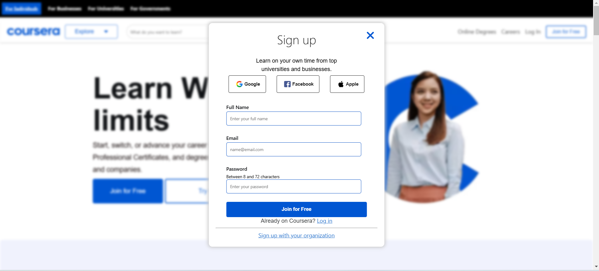
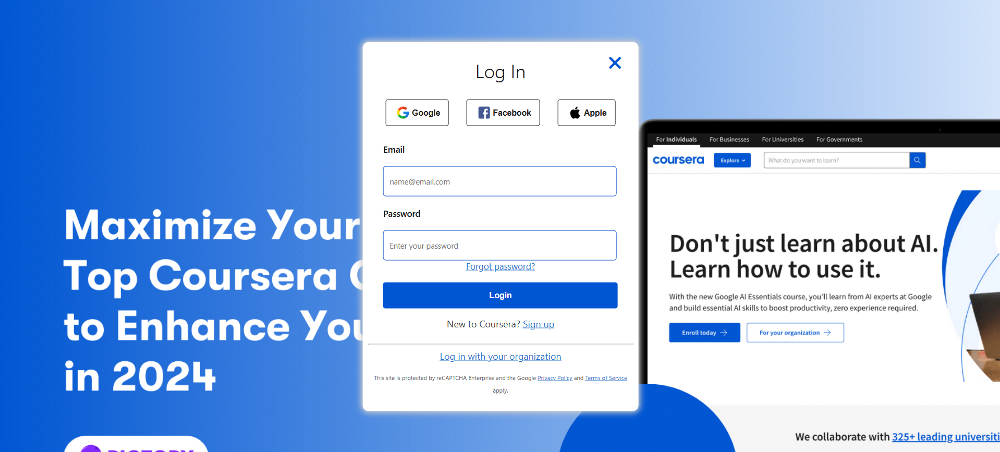
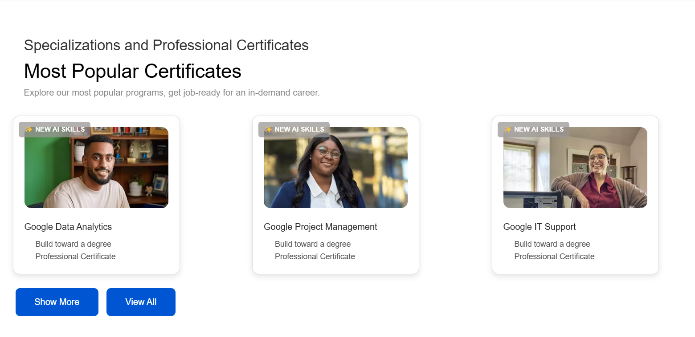
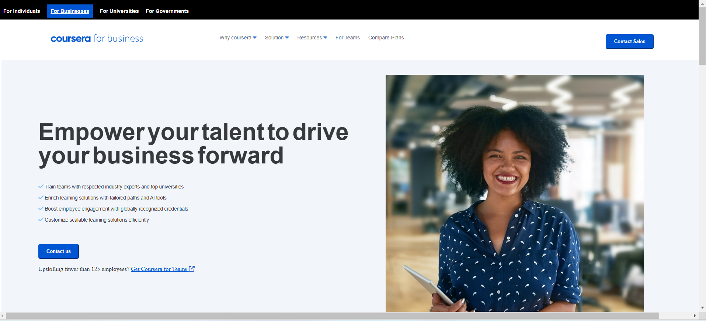
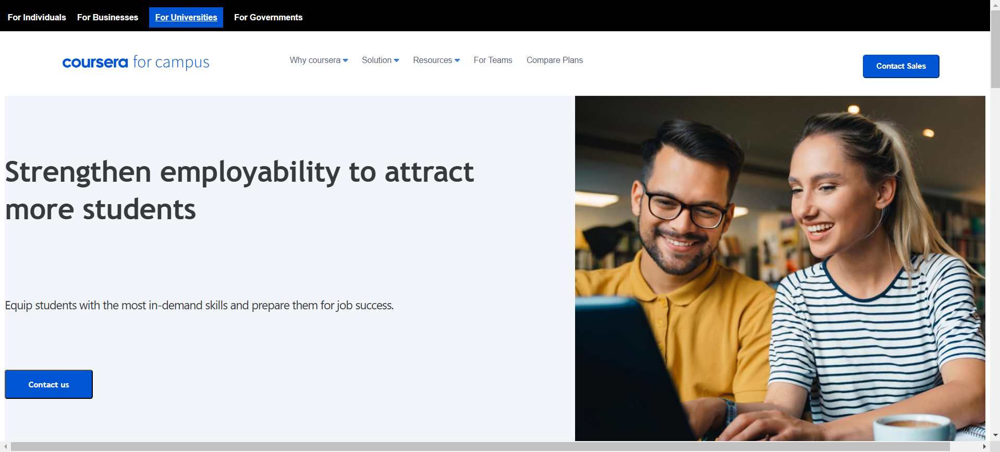

# Coursera

Welcome to **Coursera**, an online learning platform offering a wide range of courses and certifications from top universities and organizations worldwide. Coursera provides learners with opportunities to develop skills, earn professional certifications, and even pursue degrees. The platform emphasizes flexibility, allowing users to learn at their own pace, and offers engaging features like hands-on projects and interactive quizzes. With courses spanning technology, business, arts, and more, Coursera is an excellent resource for personal and professional growth.

## Table of Contents

- [Project Description](#project-description)
- [Project Type](#project-type)
- [Deployed App](#deployed-app)
- [Directory Structure](#directory-structure)
- [Technologies Used](#technologies-used)
- [Setup and Installation](#setup-and-installation)
- [Usage](#usage)
- [Features](#features)
- [Screenshots](#screenshots)
- [Video Link](#video-link)
- [Future Scope](#future-scope)
- [Team Members](#team-members)
- [Acknowledgments](#acknowledgments)
- [References](#references)

---

## Project Description

The **Coursera** replicates the core functionality of Coursera, allowing users to:

- Browse available courses and certificates.
- Register and log in using Firebase authentication.

This project aims to deliver a seamless online learning experience, enabling users to browse, enroll in, and participate in various online courses across different disciplines. It includes features like user authentication, course management, and interactive learning.

---

## Project Type

Frontend | Backend | Fullstack

---
## Project Link
https://dev-coursera.netlify.app/

---
## Deployed App

- **Frontend:** [Deployed Frontend](https://dev-coursera.netlify.app/)
- **Backend:** [Deployed Backend](https://dev-coursera.netlify.app/)
- **Database:** [Deployed Database](https://dev-coursera.netlify.app/)

---

## Directory Structure

```
B41-WEB-027-The-Dev-Detectives/
├── index.html
├── Style.css
├── index.js/
└── README.md
```

---

## Technologies Used

### Frontend:
- HTML
- CSS
- JavaScript

### Packages :
 - Chalk , axios , Firebase

### Backend:
- Firebase (Authentication and Database)

---

## Setup and Installation

Detailed instructions on how to install, configure, and get the project running.

```bash
npm install
npm start
```

To set up the project locally:

1. Clone the repository:

   ```bash
   git clone https://github.com/B41-WEB-027-The-Dev-Detectives.git
   ```

2. Navigate to the project directory:

   ```bash
   cd B41-WEB-027-The-Dev-Detectives
   ```

3. Open the project in your favorite code editor.
4. Launch the project:
   - Open `index.html` directly in a browser.
   - Or use a local server like Live Server in VS Code for better performance.

---

## Usage

Follow these steps to use the project:

1. Open the application in a web browser.
2. Sign up for an account using the signup page.
3. Log in with your credentials.
4. Explore the available courses and enroll.

---

## Features

### User Authentication:
- Firebase integration ensures secure login and signup processes.

### Responsive Design:
- Fully optimized for various devices and screen sizes.

### Course Listings:
- Dynamically rendered course details and categories.

### User-friendly Interface:
- Intuitive navigation and design for an enhanced user experience.

---

## Screenshots

1. **SignUp Page:**  
   

2. **Login Page:**  
   

3. **Home Page:**  
   

4. **Most Popular Certificates:**  
   

5. **Online Degree:**  
   

6. **For Business Tab:**  
   

7. **For Goverment Tab:**  
   

8. **For Universities Tab:**  
      

---

## Video Link

- **Project Overview:** [https://drive.google.com/drive/folders/1cl0BYn82mzTT74W5Yq5885SvjUucSMmS?usp=sharing](#)

---

## Future Scope

1. **Enhanced Course Interaction:**  
   - Add quizzes, assignments, and progress tracking.
2. **Advanced Analytics:**  
   - Integrate dashboards for tracking learning progress.
3. **Mobile App Development:**  
   - Create a mobile version for Android and iOS.

---

## Team Members

- **Shubham Bendkhale** - *Team Lead*  
- **Nandan Singh Danu** - *Team Member*  
- **Tikesh Aswale** - *Team Member*

---

## Acknowledgments

- **Masai School:** For providing the platform to learn and collaborate.  
- **Firebase:** For secure and scalable backend solutions.  
- **Coursera:** For inspiring this project.

---

